## Добрый день! 👋

<!--
**irinastu78-bot/irinastu78-bot** is a ✨ _special_ ✨ repository because its `README.md` (this file) appears on your GitHub profile.

Here are some ideas to get you started:

- 🔭 I’m currently working on ...
- 🌱 I’m currently learning ...
- 👯 I’m looking to collaborate on ...
- 🤔 I’m looking for help with ...
- 💬 Ask me about ...
- 📫 How to reach me: ...
- 😄 Pronouns: ...
- ⚡ Fun fact: ...
-->

Меня зовут Ирина, я занимаюсь разработкой AI-инструментов, автоматизацией и экспериментальными проектами на Python.  
Интересуюсь prompt engineering, генеративными моделями, AI automation и созданием прикладных сервисов на базе нейросетей.

Основной фокус:
- AI integrations
- Python backend development
- automation workflows
- prompt engineering
- AI-powered tools
- генерация изображений и видео

---

## 🚀 Основные проекты

### 📚 [WordIndexer](https://github.com/irinastu78-bot/WordIndexer)
Система для автоматической обработки и индексирования больших Word-документов со сложной структурой.

Проект разрабатывался для реального сборника научных статей объемом около 450 страниц.

Что реализовано:
- генерация предметных указателей
- генерация авторских указателей
- построение оглавления
- обработка русских и английских секций
- работа со сложным форматированием Word, включая обработку ошибок форматирования в исходном документе
- автоматическая обработка подстрочных индексов
- сохранение структуры исходного документа
- пайплайн обработки через промежуточные артефакты и debug-данные
- сбор списка e-mail авторов

Технологии:
`Python` `pywin32` `Word COM` `CSV` `Git`

Screenshots:  
<a href="images/wordindexer/article_example.png" target="_blank">
  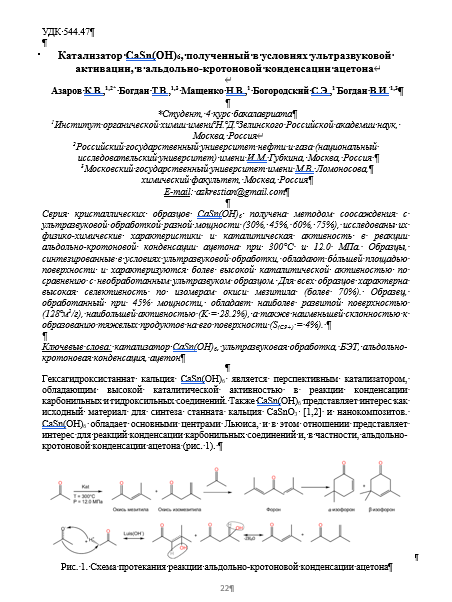
</a>
<a href="images/wordindexer/author_index_ru.png">
  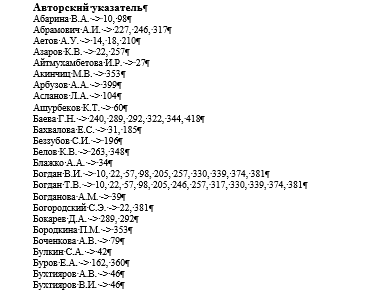
</a>
<a href="images/wordindexer/author_index_en.png" target="_blank">
  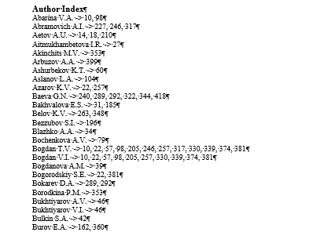
</a>
<a href="images/wordindexer/kw_index_ru.png" target="_blank">
  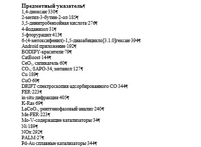
</a> 

<a href="images/wordindexer/kw_index_en.png" target="_blank">
  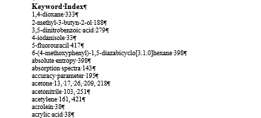
</a>
<a href="images/wordindexer/toc_ru.png" target="_blank">
  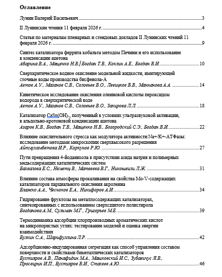
</a>
<a href="images/wordindexer/toc_en.png" target="_blank">
  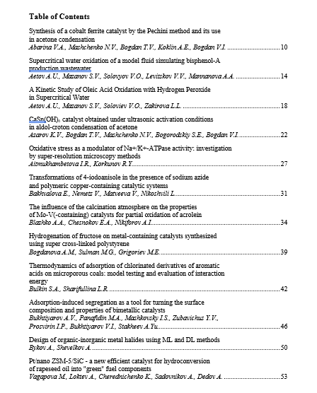
</a>
<a href="images/wordindexer/toc_ru_last.png" target="_blank">
  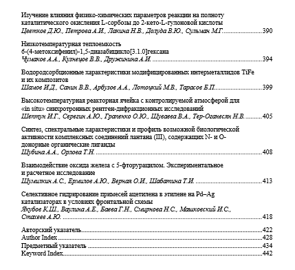
</a>

---

### 🎬 [ZeroVideo](https://github.com/irinastu78-bot/ZeroVideo)
Экспериментальный AI-сервис генерации видео с двумя независимыми интерфейсами:
- web application
- Telegram bot

Архитектура проекта:
- Flask backend
- SPA frontend
- Telegram bot на pyTelegramBotAPI
- отдельные Docker-контейнеры
- файловое хранилище вместо БД для упрощения отладки и развертывания

Особенности:
- разные сценарии обработки задач для web и Telegram
- автоматическая отправка результатов пользователю
- асинхронная обработка генерации
- разделение frontend/backend логики

Технологии:
`Python` `Flask` `Docker` `Gunicorn` `Telegram Bot API` `HTML` `CSS` `JavaScript`

Screenshots:  
<a href="images/zerovideo/telegram_gen_video.png" target="_blank">
  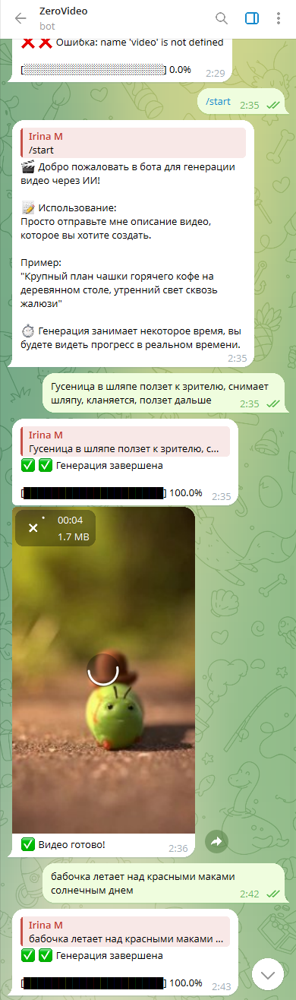
</a>
<a href="images/zerovideo/web_video_gen.png" target="_blank">
  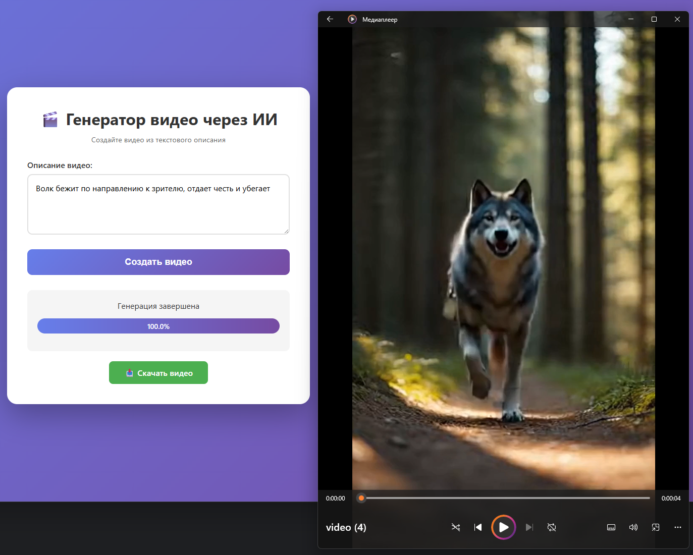
</a>

---

### 🤖 [Multi-channel AI Booking Assistant](https://github.com/Irsmile/Multi-channel-AI-Booking-Assistant)
Экспериментальный AI-ассистент для записи клиентов с multi-channel архитектурой: Telegram-бот + веб-чат + интеграция с OpenAI и Google Sheets.
В репозитории реализован пример для салона красоты. Бот консультирует клиента и записывает его на услугу, держит в памяти 20-30 сообщений чата, умеет определять из произвольного текста контактные данные, время записи и пожелания клиента, записывает лиды в аналог CRM в Google таблицах. 

Возможности:
- Telegram bot + website chat
- conversational booking flow
- Google Sheets CRM integration
- session memory
- structured lead extraction
- fallback architecture

Технологии:
`Python` `Flask` `OpenAI API` `Google Sheets API` `Telegram Bot API`

Screenshots:  
<a href="images/multichannel_ai_booking_assistant/Telegram_conversation.png" target="_blank">
  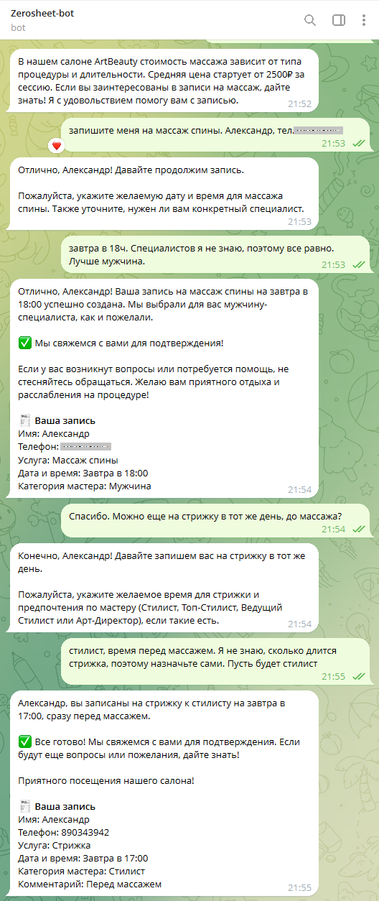
</a>
<a href="images/multichannel_ai_booking_assistant/Website_chat_UI.png" target="_blank">
  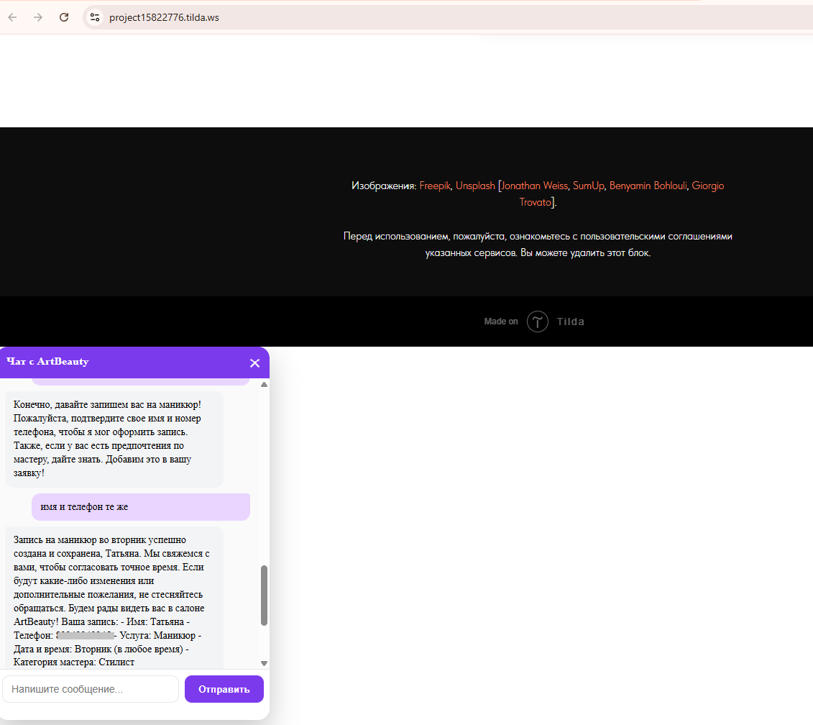
</a>
<a href="images/multichannel_ai_booking_assistant/Google_Sheets_lead_storage.png" target="_blank">
  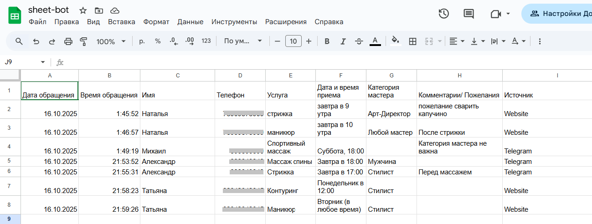
</a>

---

### 🎨[ZeroYandex](https://github.com/irinastu78-bot/ZeroYandex)
Экспериментальный AI-проект для генерации логотипов через YandexART API.

Проект создавался как исследование:
- prompt engineering
- AI API integration
- seed-based generation
- refinement workflows

Особенности:
- Flask backend
- SPA frontend
- preset styles
- refinement pipeline
- async generation polling

Технологии:
`Python` `Flask` `REST API` `Yandex Cloud API`

Screenshots:  
<a href="images/zeroyandex/redis_server.png" target="_blank">
  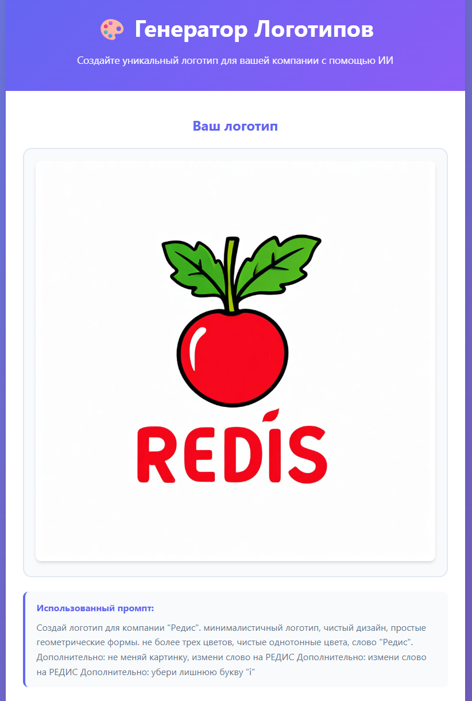
</a>

---
<!--
### 🎤 Realtime Audio Transcriber *(WIP)*
Система realtime-транскрибации аудио с локальным ASR и диагностическим pipeline.

Текущий фокус:
- realtime audio processing
- queue-based architecture
- WASAPI loopback capture
- local ASR backends
- diagnostics and debugging tools

Технологии:
`Python` `Vosk` `PyAudio` `WASAPI`
-->
---

# 🛠 Технологии

### Backend
`Python` `Flask` `REST API`

### AI / Automation
`Prompt Engineering` `LLM` `OpenAI API` `Conversational AI`

### Integrations
`Telegram Bot API` `Google Sheets API`

### Dev Tools
`Git` `GitHub` `Docker` `PyCharm`

### Frontend
`HTML` `CSS` `JavaScript`

---

# 🔬 Сейчас изучаю

- AI automation systems
- advanced prompt engineering
- web development
- model fine-tuning
- AI-assisted applications
- multimedia processing

---

## 📫 Контакты

Email: `irina.stu78@gmail.com`

---

## 📌 Дополнительно

Некоторые репозитории в профиле являются экспериментальными или исследовательскими проектами.  
Основной интерес — создание практических AI-инструментов, автоматизация процессов и интеграция нейросетевых сервисов в реальные сценарии использования.
